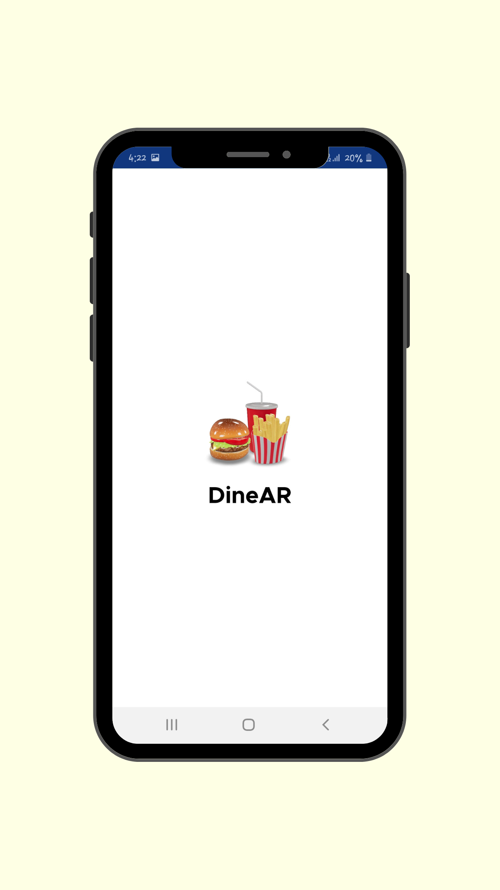
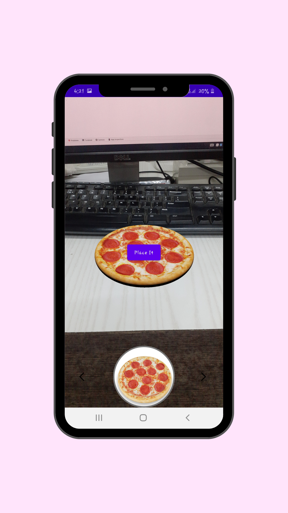
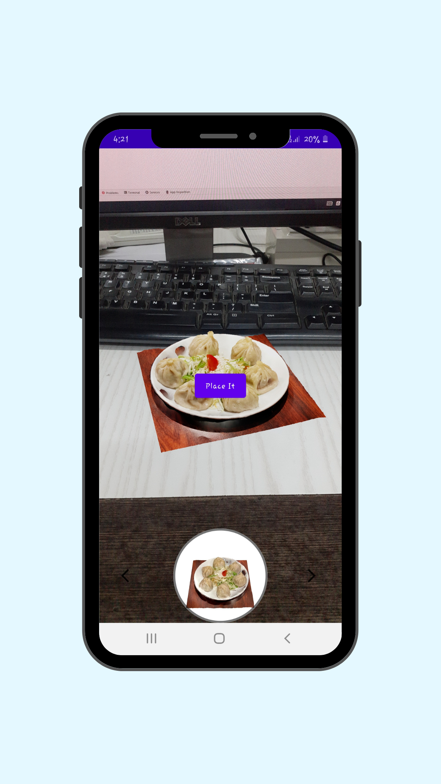
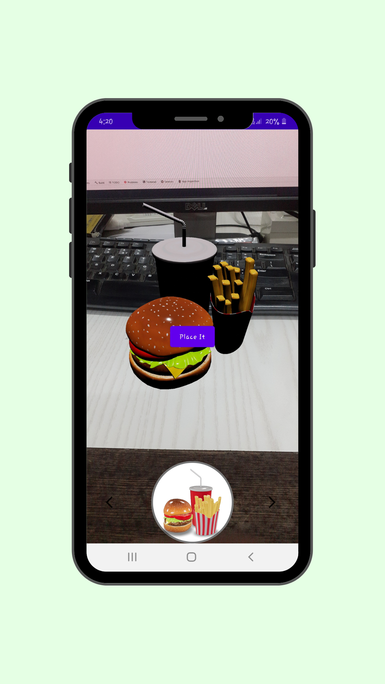

# DineAR Apps

**Title-** DineAR: Augmented Reality Restaurant Experience

**Language Used:-** Kotlin with Jetpack Compose

**Technology Used:-** Sceneview SDK use for Augmented Reality

**Screen Shots**

  
  
  
  

**Short Description -**

Revolutionize restaurant menus with this Augmented Reality (AR) source code!

This code allows you to build an Android app where customers can use their smartphones to view 3D models of menu items directly on their tables.

**Benefits:**

-Enhance customer experience with interactive menu exploration.
-Increase order accuracy and reduce confusion.
-Stand out from competitors with innovative technology.
-Built with Kotlin for smooth development in Android Studio.
-Leverages camera AI and screen view for seamless AR integration.

**Detailed Description -**

Revolutionize the dining experience with this cutting-edge Augmented Reality (AR) Restaurant Menu source code!

Enhance customer engagement and boost order accuracy with this Android app source code built using Kotlin for seamless development in Android Studio.

Here's what this source code offers:

1.Interactive 3D Food Previews: Leverage the power of AR to allow customers to view stunning 3D models of menu items directly on their tables using their smartphones. This interactive experience eliminates confusion and helps customers visualize dishes before ordering.

2.Increased Customer Satisfaction: By allowing customers to explore menu items in 3D, they can make more informed choices, leading to a more enjoyable dining experience and potentially higher order values.

3.Stand Out from the Competition: This innovative AR technology sets your restaurant apart, creating a buzz and attracting tech-savvy customers seeking a unique dining experience.

4.Seamless AR Integration: The source code utilizes camera AI and screen view functionalities to ensure a smooth and effortless AR integration within the app.

5.Built with Kotlin for a streamlined development process within the familiar Android Studio environment. Kotlin's modern and concise syntax makes the code easier to understand and modify.

6.Scalable and Customizable: The code is built with scalability in mind, allowing for easy customization to match your restaurant's branding and menu.

This source code provides a solid foundation for you to build a fully functional AR Restaurant Menu app. With further development, you can integrate additional features such as:

1.Detailed Menu Descriptions and Pricing: Overlay text information on the 3D models displaying dish descriptions, ingredients, and pricing for a complete menu experience.

2.Ordering Functionality (not included in current code): Integrate the app with your existing Point-of-Sale (POS) system to allow customers to directly place orders within the app for a truly seamless experience.

3.Customization Options: Allow customers to personalize their virtual dishes by choosing different ingredients or portion sizes within the AR view.

By implementing this AR Restaurant Menu app, you can:

-Increase customer engagement and satisfaction.
-Boost order accuracy and reduce confusion.
-Improve brand image and stand out from the competition.
-Maximize efficiency and streamline the ordering process.

This source code is ideal for:

-Restaurant owners and developers seeking to create a unique and engaging dining experience.
-Developers looking for a pre-built foundation for an AR menu app project.
-Anyone interested in exploring the potential of AR technology in the restaurant industry.

Don't miss this opportunity to take your restaurant's menu to the next level!

**Support**

For any issues or support, please contact:
Email: hello@vite.biz
Website: https://www.vite.biz/